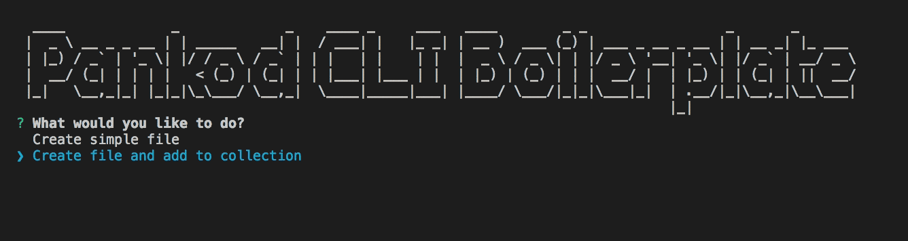

<div align="center">
 
</div>
<br/>
<br/>

<div align="center">
CLI boilerplate for create  project file and content with predefined templates for all type of file extensions.

</div>
<br/>

<div align="center">
  <!-- CodeCov -->
  <a href="https://codecov.io/gh/pankod/cli-boilerplate">
    
  </a>
  <!-- Build Status -->
  <a href="https://travis-ci.org/pankod/cli-boilerplate">
    
  </a>
  <!-- Dependency Status -->
  <a href="https://david-dm.org/pankod/cli-boilerplate">
    
  </a>
  <!-- devDependency Status -->
  <a href="https://david-dm.org/pankod/cli-boilerplate#info=devDependencies"> 
    
  </a>
</div>

<br/>
<div align="center">
  <sub>Created by <a href="https://www.pankod.com">Pankod</a></sub>
</div>
<br/>

<br/>

## About

 By using the CLI tool, you may easily: 

   - Create new files and folders with any file extension,
   
  -  Add predefined content to newly created file by using built-in mustache templating engine.

<br/>

## Getting Started


Run the following method:


```sh
npm install
```
<br/>
Once the installation is done, you should run the following command for compile Typescript:

 ```
 npm run build
 ```

 It saves javascript files to dist folder.

<br/>
Run the following command for compile typescript code anytime you made changes in code:

 ```
 npm run watch
 ```
<br/>
 Once the installation is done, you can run the following command to start CLI.

 ```
 npm run start
 ```

<br/>


#### To customize helper-cli-boilerplate according to the needs of your project:

- Add a new mustache template to templates folder and define file path to methods in helper.ts.

    More info about [mustache.js](https://github.com/janl/mustache.js)

<br/>

#### TODO:

- add child page

#### Outline of some logics behind the methods:

#### With supported features

  ##### 1. Page create

    - Create page and module place

    - Custom alias path for the page

    - Auto generate definition file

  ##### 2. Component create

    - can specific component place

  ##### 3. For both

    - can auto export and append to index

    - use styled component

